# Introduction to Artificial Intelligence for security pros

> Cylance

# Contents:

* **Introduction:** 
* **Clustering:** K-means and DBSCAN Algorithms
* **Classification:**Logistic Regression and Decision Tree Algorithms
* **Probability:**
* **Deep Learning:**

# Introduction

* **Artificial Superintelligence:** Produce computers which are superior to humans in every way
* **Artificial General Intelligence:** Machine as intelligent as a human and equally capable of solving the broad range of problems that require learning and reasoning. (Turing test)
* **Artificial Narrow Intelligence:** Exploits a computer's superior ability to process vast quantities of data and detect parrerns and relationships that would otherwise be difficult or imposible to a human to detect.

## Machine learning in the security domain

The context in wich we have to focus on protecting a specific service is important. 
For example, in a website's domains, the context is connection.
Fortunately, these activities generate a vast ammount of logs by sensors and software.
These logs can provide the contextual data we need to identify and ameliorate threats.
These is the kind of precessing ML excels.

# Clustering Using the K-Means and DBSCAN Algorithms

The purpose of cluster analysis is to segregate data into a set of discrete groups or clusters based on similarities among their keey features or attributes.

A variety of statistical, artificial intelligence, and machine learning techniques can be used to create the clusters.

In the network security domain, cluster analysis tipically proceeds through a well-defined series of data preparation and analysis operations.

## Step 1: Data selection and sampling

Ideally, we want to collect all of the data generated by our network, but sometimes, this is neither possible or practical, so we apply statistical sampling techiques that allow us to create more manageable subset of the data for our analysis.
The sample should reflect the characteristics of the dataset as closeley as possible, or the accuracy of our results may be compromised.

> For example, if we decide to analyze the internet activity for ten different computers, our sample should include representative log entries from all ten systems.

## Step 2: Feature extraction

In this stage, we decide which data elements within our sample should be extracted and subject to analysis. *In ML, this is known as Features*

> In security, the relevant features might include the percentage of ports that are open, closed, or filtered, the application running on each of these ports, and the application version number.

It is good practice to include as many features as needed, excluding the ones you know are irrelevant, because these increase processor time 

## Step 3: Feature Encoding and Vectorization

Most ML algorithms require data to be encoded or represented in some mathematical fashon.
One very common way data can be encoded is by mapping each sample and its set of features to a grid of rows and columns. Once structured in this way, each sample is refered to as a *vector* The entire set of rows and columns is refered to as a *matrix*
The encoding process we use, depends on wether the data representing each feature is *continuous, categorical*, or od some other type.

Continuous data can ocupy any nuber of infinite value within a range of values.
For example, any vlaue between 0 ant 100, for cpu tempertarure.

Categorical data is represented by a small set of permissible values within a much more limited range.
For example, software version or name.
It is inherently useful in defining groups.
For example, OS version or SW name, to group computers with similar characteristics.
These categories, must be encoded as numbers before mathematical analysis.
One example: OS

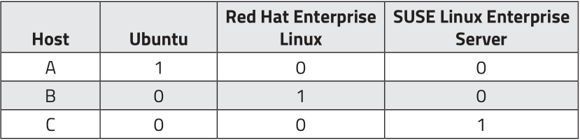

It is important to normalize data, so the algorithms give the same weight to diferent values and don't overblow higher values.

## Step 4: Computation and Graphin

Once we finish maping data, we can import it to a suitable statistical analysis or data mining application. 

## Clustering with K-Means

Clustering analysis introduces the concept of a "Feature space" that can contain thousands of dimensions, one each for every feature in our sample set.
Clustering algorithms assign vectors to particular coordinates in this feature space and then measure the distance between any two vectors to determine weather they are sufficiently similar to be grouped together in the same cluster.

### Caveats

* This version of K-Means works with continuous data only
* The data can be meaningfully grouped into a set of similarly sized clusters

### Clustering session

1. Dataset sampled, vectorized, normalized and imported into scikit-learn
1. Data analyst sets K hyperparameter (Number of clusters to generate)
1. K-means randomly selects three vectors and assigsn coordinate in frature set (Centroids)
1. K-means assigns each vector to it's nearest centroid
1. K-means examnes the average distance from each vector to it's centroid. If the centroid's current location matches this computed average, it remains stationary. Otherwise, the centroid is moved to another coordinate wich matches the computed average
1. K-means repeats step 4 for all of the vectors and reassigns them to clusters based on the new centroid location
1. K-means iterates through step 5-6 until
    1. The centroid stops mooving and it's membership remains fixed: *Convergence*
    1. The algorithm completes the maximum number of iterations specified in advance by the analyst

Once the clustering is completed, the analyst can:

* Evaluate accuracy using a variety of validation techiques
* Convert results into a mathematical model, to assess the cluster membership of new samples
* Analyze the cluster results further using aditional statustical and machine learning techiques

### K-Menas pitfalls and limitations

* The analyst must make an informed guess as to how many clusters should be created
    * Have to repeat the clustering operation until the optimum cluster size has been reached
* The clustering results vary drastically depending on where the first centroids are created
* Euclidean distance breakes down to a measure of similarity in very high dimensional feature spaces. This is known as the "Curse of dimensionality"

## Clustering with DBSCAN

> Density Based Spatial Clustering of Applications with Noise

* DBSCAN identifies clusters by evaluating the density of points within a given region of feature space.
* DBSCAN constructs clusters in regions where vectors are most denesley packed and considers points in sparse regions to be noise.
* DBSCAN discovers for itself how many clusters to create
* Is able to create cluster of virtually any shape and size
* DBSCAN presents analyst with 2 hyperparameters:
    * Epsilon (Eps): Radius of the circular region surrounding each point, to evaluate it's membership
    * Minimum Points (MinPts): Minimum number of points that must appear within an Epsilon neighborhood for the points inside to be included in a cluster.
* DBSCAN performs clustering by examining each point in the dataset and then assigning it to one of three categories:
    * *A core point:* Point that has more than the specified number of MinPts within it's Epsilon neighborhood
    * *A border point:* Point that falls within a core point's neighborhood but has insufficient neighbors of it's own to be a core point
    * *A noise point:* Neither a Core point or a Border point

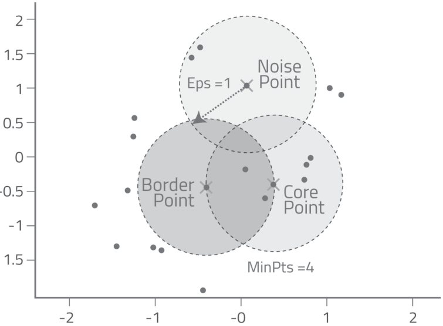

### DBSCAN clustering session

1. Dataset is sampled, vectorized, normalized, and then imported into scikit-learn
1. Analyst builds a DBSCAN object and specifies the initial Eps and MinPts values.
1. DBSCAN randomly selects one of the points on the feature space and count the number of points that lie within this point's Eps neighborhood. If this number => than MinPts, then the point is classified as a core point and DBSCAN adds point A and it's neighbors to a cluster
1. DBSCAN moves from Point A to one of it's neighbors, eg Point B, and then classifies it as either a core or border point. If Point B classifies as a core point, then point B and it's neighbors are added to the cluster and assigned the same cluster ID. This process continues until DBSCAN has visited all of the neighbors and detected all of that cluster's core and border points.
1. DBSCAN moves to a point that it has not visited before and repeats steps 3 - 4 until all of the neighbor and noise points have been categorized. When this process concludes, al of the clusters have been identified and issued cluster ID's.

If the results are satisfactory, the clustering session ends. If not, the analyst can:

* Tune the Eps and MinPts hyperparameters
* Change the distance calculation algorithm. DBSCAN supports:
    * Euclidean Distance
    * Manhattan or City Block Distance
    * Cosine Similarity

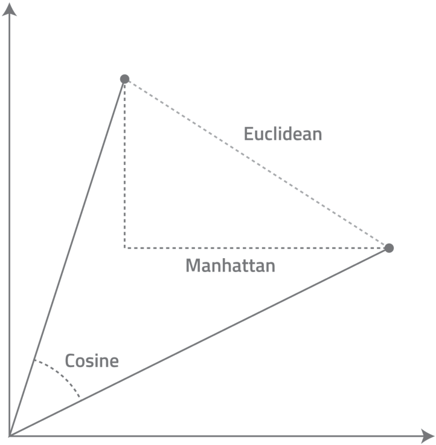

### DBSCAN pitfalls and limitations

* Extremely sensitive to small changes in MinPts and Eps settings.
* < computationally efficient as more dimensions are added
* Performs poorly with datasets that result in regions of varying densities due to the fixed values that must be assigned to MinPts and Eps.

## Assessing Cluster Validity

* Run sample set through an external model and see if the resulting cluster assignments match our own
* Test our results with "Hold out data" (Data from our dataset not used to generate cluster model)
* Use statistical methods. (K-means can use Silhouette Coefficient, wich compares the average distance between points in a cluster to those in other clusters. The lower the result, the better)
* Compare results produced by diferent algorithms or by the same algorithm using diferent hyperparameter settings.

## Cluster Analysis Applied to Real-World Threat Scenarios

### Example with the Panama Papers breach:

If we map our network logs to clusters, including data like upload and download speeds, location of connection, emails processed versus emails sent, we could cluster the data and look for outliers, generated by the DBSCAN cluster algorithm.
This might have been useful to detect strange behaviours and act rapidly upon their discovery. 
This advantage lies in that it only needs data to detect outliers, no IPS / IDS needed or Antivirus

### Clustering Session Utilizing HTTP Log Data (Practical course)

### Clustering takeaways

Clustering provides a mathematically rigorous approach to detecting patterns and relationships among network, application, file, and user data that might be dificult or imposible to secure in any other way.

* Cluster analysis can be applied to virtually any kind of data once the relevant features have been extracted and normalized
* In cluster analysis, similarity between samples and their resulting cluster is determined measuring the distance between vectors.
* K-Means and DBSCAN are easy to use, efficient and broadly applicable. They are also vulnerable to "Curse of dimensionality" and may not be suitable when analyzing extremely high dimensional feature spaces.
* Clustering results must be statistically validated and carefully evaluated with respect to real world security threats.
* Clustering is particularly useful in data exploration and forensic analysis because it allows us to sift through vast ammounts of data to identify outliers.

# Classification Using The Logistic Regression and Decision Tree Algorithms

* **Classification:** The process of assigning an unknown object to a known category in order to make informed decisions
* **Classification in Machine Learning:** A set of computational methods for predicting the likelyhood that a given sample belongs to a predefined class

In **binary classification**, the elements classified, fall either in one class or another. 
(e.g: A email is *spam* or is *not spam*) 
By convention, samples that posess the attributes that we are investigation (email is *spam*), are labeled as belonging to class 1, while that labels that dont posess this attribute, are labeled as belonging to class 0.

In **multiple classification**, a sample can belong to multiple classes at the same time.

In **multinominal classification**, a value is assigned to one class among a value of three or more.

We will consider only binary classification

* **Classifier:** Algorithm used to perform classification.

We will analyze the logic regression and decisions trees. (Binary classification classifiers)

## Supervised Vs. Unsupervised Learning

* **Classification:** Supervised Learning 
    * An analyst builds a model with samples that have already been identified with respect to the property under investigarion.
    * The job of the classifier is to ascertain how the feature attributes of each class can be used to predict the class of new, unlabeled samples.
* **Clustering:** Unsupervised Learning
    * The properties that distinguish one group of samples from another must be discovered.

## Typicall classification session

1. *Training* phase
    1. Analysts construct a model by applying a classifier to a set of training data
    1. The training set consists of two files: A matrix of sample data and a Vector of labels (1 per row in the matrix) 
1. *Validation* phase
    1. Analyst applies the validation data to the model, to assess accuracy
    1. Analyst tweaks hyperparameters, to achieve maximum accuracy
1. *Testing* phase
    1. assess the modal's accuracy with test data withheld from the training and validation phases
    1. If results are satisfactory, the analyst can proceed to *deployment* phase
1. *Deployment* phase
    1. The model is applied to predict the class membership of new, unlabeled data.

## Classification via Logistic Regression (LR)

* **LR** is a linear classifier.
    * Mathematically, LR utilizes straight lines and planes to distinguish vectors belonging to one class or another.
* **Fitting**: The process of carving the feature space into two regions
* **Decision Boundary:** The line or plane that  separates one region from another
* **Solver functions**: Functions used to determine the location of the Decision Boundary
    * We will look at the *liblinear* solver and how it applies the *coordinate descent* method

### The role of regression weights

Then play a central role in determining how much each feature and feature value contributes to a given vector's class membership.
This is achieved by multiplying each feature value by it's coresponding weight:

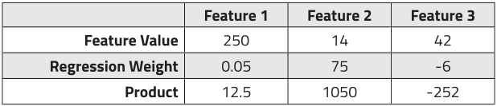

Positive and negative values contribute to class 1 and class 0 respectively.

To predict the class, LR sums all of the products together with a computed *bias* value.
If the aggregate sum is >= 0, LR will predict the sample as belonging to class 1.
If the value is < 0, LR will predict the sample as a class 0 member.

In our example above, LR would sum 12.5, 1050 and -252 for a sum of 815.5.
Since the sum is >= 0, our sample would be predicted to belong in class 1.

Most of the training phase of a LR session is devoted to optimizing the linear regression weights.
The algorithm will eventually find the best distribution of weights, given enough time.

### The role of regularization and penalty parameters

**Regularization:** The use of a penalty parameter C to compress the range of regression weights in much the same way they use normalization to compress feature values.

C controls how large the weighted values can become.
Models with extremely high weight ranges, do a excelent job at predicting the class of training vectors, but produce sub-par results when applied to test data. 
This is called: *over-fit* the data.

**Penalty parameters *L1* and *L2*:** Control wich features are allowed to influence the classifier in computing regression weights. 

*L1* sets a threshold that determines how aggresive LR should be in eliminating features with comparativeley low predictive power.
The higher the weight to *L1*, the more features will be executed.

*L2* minimizes the impact of a group of highly correlated features so that their collective influence does not skew the results.

### Logistic Regression Training Phase

In this phase, the analyst's primary goal is to fit the data by producing an optimized set of regression weights.

*Step 1: Data import and Session Setup*

The analyst imports two files:

1. A matrix of normalized training samples
1. A vector of labels that define each sample's class membership

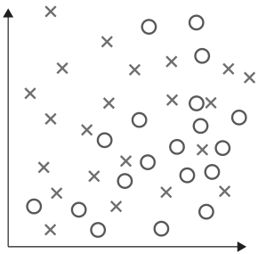

*Step 2: Regularization and Regression Weight Optimization*

An initial set of regression weights are assigned, and the analyst invokes a *likelyhood* function.
This compares the actual number of positive and negative cases to the aggregate quantity predicted using the initial weights.
The resulting score is used to calculate a positive or negative ajustment to each weight's value.
The analyst can control the size of this ajustment on a feature-by-feature basis by utilizing a *learning rate* parameter. 
Over the course of the repeated calculation cycles, the regression weights will gradually and incrementally move closer and closer to their optimal values.
After each optimization, the analyst can experiment with diferent penalty parameter settings and then address toe resulting model.

*Step 3: Assigning Probability Scores to Class Predictions*

LR is intrinsically a method for predicting the probability that a given vector belongs to a particular class. 
LR includes a *logit function* that converts the classification result into a point along a probability curve that ranges from 0 - 1.
The closer the point is to probability score approaching y=1, the stronger the prediction will be that the sample belongs to class 1.
The closer the point is to p=0, the more strongly it will be predicted to belong to class 0.

*Step 4: Exporting the Logistic Regression Model*

The resulting classification model can now be exported and subjected to testing.
Mathematically, the model consists of the bias value along with a vector of regression weights.
Once these have been computed, the coordinates of the decision boundary can be calculated.

In the simplest case of a classification problem with only two features, the equation takes the form `x2 = -(m1/m2) x1 + b` in which *x1* and *x2* are the feature values, *m1* and *m2* are their respective regression weight and *b* is the bias value.

If there are two features, the decision baoundary will comprise a line. 3, a plane, etc...

### Logistic Regression Testing Phase

The analyst assesses the model by exposing it to data it hasn't seen before and then measuring the accuracy of it's predictions.

To validate it's predictions, you can use the *confusion matrix* function.
It examines each sample in turn and then compares it's predicted class membership to it's actual class label. 
Next, it assignes the prediction of that label to pne of 4 categories:

* True Positive: Correctly predicted to belong to class 1
* True Negative: Correctly predicted to belong to class 0
* False Positive: Predicted to be class 1, but is class 0
* False Negative: Predicted to be class 0, but is class 1

**Validation metrics on matrix data**

* **Precision:** Rate at wich a model's positive prediction is a correct one. `P = TP / TP+FP`
* **Recall:** Rate at wich a model correctly classifies a positive case. `R = TP / TP + FP`

**Model's overall accuracy and errors in classifying negative cases**

* **Mean accuracy:** `MA = (TP + TN) / Total samples`
* **Missclassification Rate:** `MR = 1 - MA`
* **False Positive Rate:** `FPR = FP / Actual Negatives`
* **Specificity:** `S = TN / Actual Negatives`
* **Prevalence:** `P = Actual Positives / Test Samples`

### Model Evaluation Using Receiver Operating Characteristic Curves

Receiver Operating Characteristic (ROC) Curves provide a convenient and visually intuitive way to access the quality of a model's predictions and to compare the accuracy of one model against another in solving a binary classification problem.

* The more accurate the model is, the closer it's ROC curve will be to the upper left quadrant.
* The `y = x` ROC curve would be a model in wich data is predicted randomly
* A model is predicting a lot of false positives if it's ROC curve is close to the lower right quadrant.

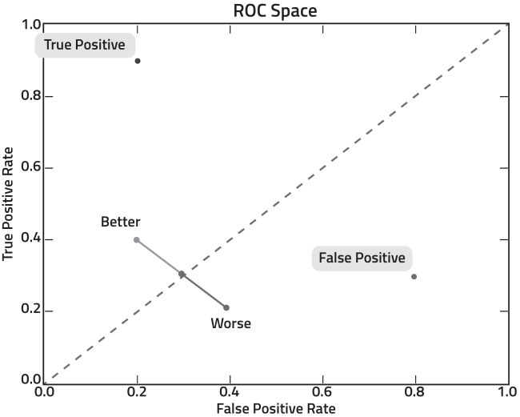

To plot our curve, we count the number of samples our model scored correctly and incorrectly at each probability threshold.
The probability score for each of these predictions is indicated in the X-axis 
The number of predictions is located in the Y-axis
If there is little overlap between prediction curves, we have done a good job.
The majority of overlaps, will occour at threshold 0.5, where the algorithm will have a hard time deciding if it's one class or another.

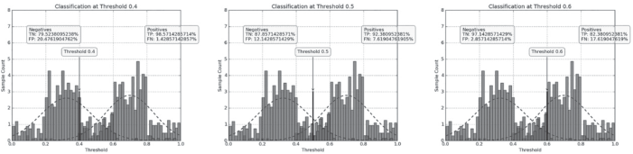

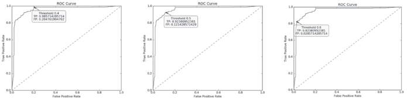

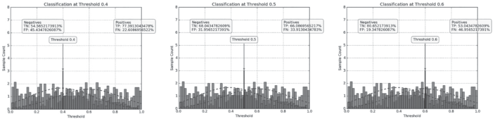

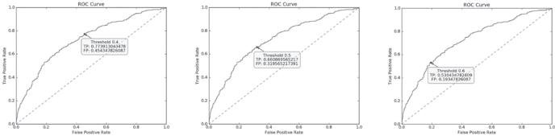

### Logistic Regressions Pitfalls and Limitations

Produces excelent resunts when:

* Underlying data must intrinsically support linear classification (Dataset must be linarly separable)
* LR is vulnerable to under-fitting when dataset have many outliers, features with disproportionally large values, and sets of features that are highly correlated. Normalization and regularization can only partly offset these effects.

## Classification through Decision Trees

Define weather a given vector belongs to a one class or another by defining a sequence of `if-then-else` rules that terminate in class prediction

The type of DT algorithm selected depends on whether the class label will have categorical or continuous values.

* **Categorical**: Use *DT classification*
* **Continuous**: *DT regression*

We will focus on DT classification

* Non-linear
* Carves feature space into rectangles that may contain as little as a single vector each
* Splits samples into increasingly "pure" subsets based on their features and feature value 

### Decision Tree terminology

With the example below, we can conclude a URL will be classified as **benign** (Class 0) if:

* Site has < 250K visitors daily but the URL was not autogenerated
* Site was included on alexa Top Sites list
* Site wasn't included on Alexa Top Sites list but no threat intelligence report has been issued about the domain registrant.

The URL will be classified as **Malicious** (Class 1) if:

* Site has < 250K visitors daily and the URL was autogenerated
* Site was not included in Alexa Top Sites and a threat intelligence report has been issued about the domain registrant

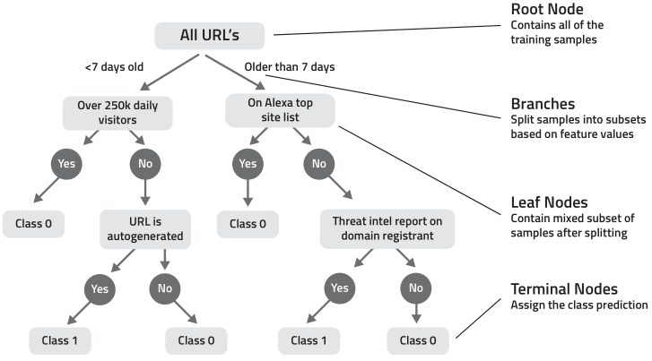

### DT Training Process 

Considering a sample of 500 vectors:

1. DT examines all 500 vectors and selects the first available feature to evaluate as a potential split point. (Split variable)
1. DT examines the range of values associated with this feature and chooses an initial *split value*.
1. DT copies samples with feature values less than the *split value* to child node #1 and samples with feature values >= to the *split value* to child node #2.
1. DT evaluates the resulting reduction in impurity by computnig a *Gini Impurity* score cor each of the child nodes or leaves. Next, the two scores are aggregated, to produce a overall benefit score for the split candidate. (The *Split Value* in the step above)
1. DT chooses the next split value and repeats the process. DT continues the process for every other split value until all of the Gini impurity and benefit scores for that feature have been computed.
1. DT selects the next feature in the feature set and repeats steps 2 - 5 iterating recursiveley through every split value and producing Gini impurity and benefit scores for each new set of candidate leaves. This process continues until all of the features and split values have been assessed.
1. DT chooses the feature/split value combination that produces the best overall benefit score and uses this to add new branches and leaves to the tree. 
    1. (At this level, each of the resulting leaves still contains a mix of class 0 and class 1 samples.
1. DT begins the same process for each of the two new leaves until the tree is *saturated* (All nodes are perfectly pure) or DT encounters a *stopping criterion* associated with one of the hyperparameter settings.
1. The analyst can then *prune* to remove extranuous branches

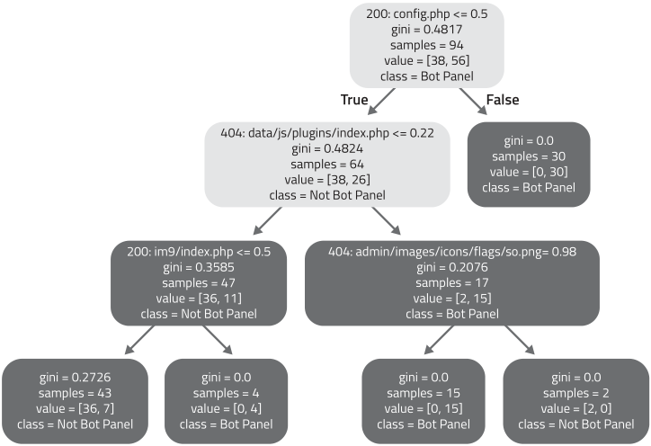

### Decision Tree Classification

> Steps and methodology that comprises the training, testing, and deployment phases of a typical decision tree classification session with *scikit-learn*

*Step 1: Data Import and Session Setup*

1. Import a matrix of training samples
1. Import a vector of labels that define each sample's class membership

*Step 2: Generating and customizing the Tree*

Most of the algorithm processing time spent is devoted to optimizing split points in order to produce an efficient model that meets the desired accuracy threshold without over-fitting the data.
The default Hyperparameter settings provided by scikit-learn would suffice in most cases.
When there are large number of outliers, the DT will *over-fit* data and will *fail to generalize*.
To prevent this, the hyperparameters below can be eddited.

* *max_depth:* Max number of branches and leaves before the tree construction ends
* *min_samples_split:* Min number of samples a node must posess to be eligible for a split
* *min_samples_leaf:* Min number of samples needed to create a child leaf
* *max_leaf_nodes:* Total max leaves
* *feature_importances:* The higher the setting, the more likely the feature will be utilized as a split variable
* *n_features:* How many features overall can be used to construct the tree

#### Assigning Probability Scores to Class Predictions

The DT algorithm intrinsically generates a probability score for every class prediction in every leaf based on the proportion of positive and negative samples it contains.

> `Number of samples of either class / Total number of samples in that leaf`

*Step 3: Testing and Deployment*

Same as Logistic regression.

### Decision Tree Pitfalls and Limitations

* Can produce overly complex trees that over-fit the data
* The larger the feature set, the more likely pver-fitting is to occuor
* Split points is determined based on "local" optimizations between a parent node and it's chind leaf, rather than taking into account the whole tree
* Can be unstable (Small variation in sample data, can produce a completely different tree)

These issues can be addressed by generating ensembles of trees from random subsets of training data. (Random Forest algorithm)
Each tree then "votes" on wether a given sample belongs to one class or another.
The prediction with most votes, wins.

## Classification applied to real world Security Threats

We will be detecting botnet C&C systems that are currently in the wild today

### Collecting and preparing our sample data

#### 1. Data collection

* We collect data produced from issuing HTTP requests for the 4789 websites offsets known to be associated with 13 different botnet panels.
* We sort files into groups based on their response codes
* We produce fuzzy-hashes of eack file (With ssdeep)
    * Uset do assess how similar a file is to another without examining the file contents directly
* We normalize the resulting data

#### 2. Feature extraction 

* Each vector includes 357947 features
* These features are associated with 14 different labels.
* 13 of these labels are associated with our known botnet panel sites.
* The 14th label represents our set of clean servers.
* Each feature will consist of a response code and a hashed value.

#### 3. Vectorization

* Assemble vectors using the features we just created
    * This produces a matrix of vectors 

### Training Phase

DT and LR algorithms examine all of the features and their hash values to assess the degree of similarity between offsets originating from the C&C and benign servers respectively.

#### Classification with Decision Trees

* If we are satisfied with the hyperparameter settings in scikit-learn, we can start training immediateley.
* Once the algorithm is complete, it will output the model `bot_model.mdl` and display a threshold graph and ROC cruve assessing it's accuracy. 
* We can view the decision tree, named `tree.png`. 

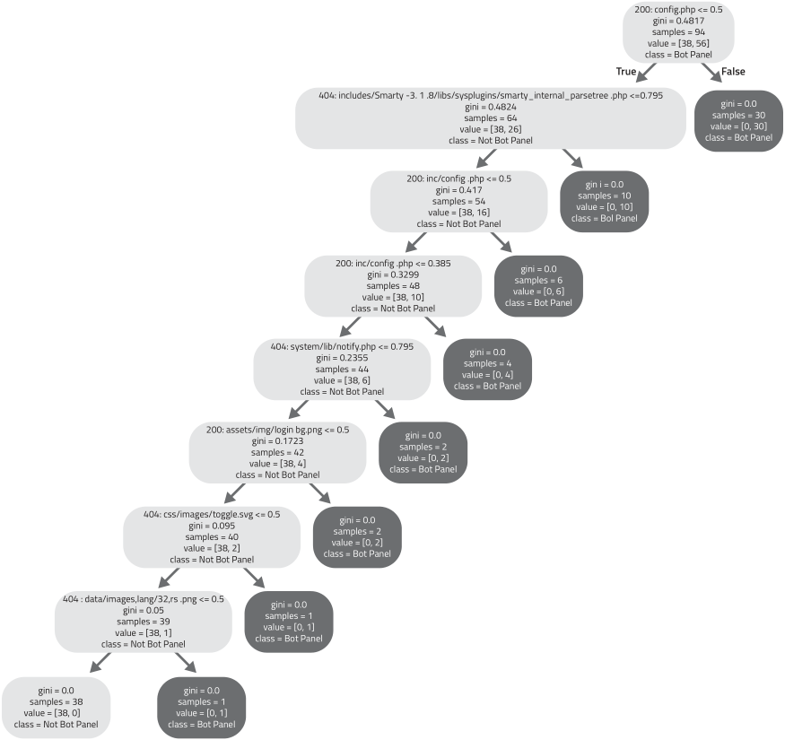

* The root contains 94 samples of mixed classes.
* Our first split variable is the *config.php* feature and our split value is <= 0.5.
    * 64 root samples match this criterion (Therefore the condition is true)
    * The samples have been copied to the 404 child node on the left.
        * The Gini score of 0.4824 indicates that this node contains samples of both classes, so additional splitting will be required.
    * 30 root samples do *not* match the splitting criterion (i.e, the condition is false)
        * These samples are copied to the child node on the right. (Gini score 0.0 means we have perfect purity)
        * 30 samples belong to class 1, therefore a botnet pannel
        * 0 belong to class 0, not a botnet pannel
        * We have arrived at our first terminal node 
* Continuing to the last node on the tree, it's child node contains 38 samples belong to benign servers and 1 sample belonging to a C&C server.
* All of our samples have been classified, we can export our model file for deployment.
* The model above is extremely efficient because we only need 8 features, instead of the 357947 we began with.
* When we begin collecting new unlabeled samples, we can limit our HTTP requests exclusively to these 8 features.

#### Classification with Logistic Regression

* Adjust hyperparameter setting 
* Logistic Regression is not as aggresive as DT in reducing features

### Deployment phase

* Resulting model will use these comparisons to predict wether a particular offset is associated with a botnet C&C system or not.

### Classification Takeaways

* Supervised learning method that works well when there is a sufficient quantity of labeled data
* Classification is a 4-phase method: 
    * Training
    * Validation
    * Testing
    * Deployment
* LR and DT are both very effective, but take very different approaches to classification
* LR are prone to under-fitting, since they must carve feature space up using straignt lines and planes
* DT carve feature space in rectangles are are more prone to over-fitting, since unless stopping criteria are applied, they create decision rules for every vector
* Validation methods to test models
    * Confusion matrices
    * Probability Threshold Diagrams
    * ROC curves
    * ...

# Probability

We will examine the Naive Bayes classifier and the Gaussian Mixture Model cluster algorithm and consider how they can be applied to solve security-related detection and remediation problems

## What exactly is probability?

Probabilistic models are well suited to solve problems in which we have insufficient or imperfect knowledge.
Particularly effective in modeling uncertainty.
Properly utilized, they enable us to reduce uncertainty to the point at which we can make decisions with a high degree of confidence.

### Conditional VS. Joint Probability

* In *Conditional Probability* our goal is to determine the probability that event B will follow event A
* In *Joint probability* our goal is to determine the probability of event A and B occouring at the same time

## Classification with Naive Bayes Algorithm

Bayes Theorem provides the means to calculate the probability that a given event A will occour when condition B is true.
In a classification problem, Bayes Theorem enables us to compute the conditional probability that a sample belongs to a particular class given its feature attributes.

In supervised learning, the Bayes theory might be dificult to solve because it takes conditional probabilities into account. It computes the probability relationships between every feature in the dataset in the course of producing a classification decision.

The Naive Bayes Theorem dramatically simplifies this process by making the assumption of *class conditional independence*.
It ignores the effects of conditional probability when it assigns samples to classes.
In almost every case, this assumption is untrue.

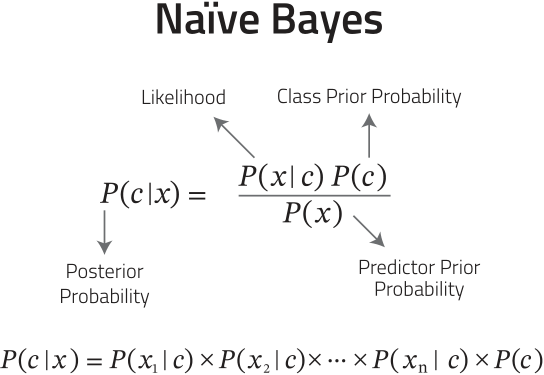

* **Posterior Probability:** Probability of a sample belonging to a particular class (C) given it's feature attributes (X). The result with the highest probability determines which class is assigned.
* **Class Prior Probability:** Refers to the prevalence of the class in the dataset.
* **Predictor Prior Probability:** Prevalence of the *feature attribute* in the dataset.
* **Likelihood:** Probability of finding feature attribute X given C

There are several variants of the Naive Bayes.
The 3 most popular are: 

* **Bernoulli Naive Bayes:** (BNB) Well-suited for spam-detection and other text-based problems in which vectors have been encoded to indicate the presence of a particular string.
* **Multinominal Naive Bayes:** (MNB) Well-suited for spam-detection and other text-based problems in which vectors have been encoded to indicate the frequency with which a text string appears
* **Gaussian Naive Bayes:** (GNB) Appropiate with continuous data that falls within a normal or gaussian distribution 

### Naive Bayes in action

Our goal is to determine weather a given remote computer is running Windows or Linux based on the network services it provides.

# Deep Learning
